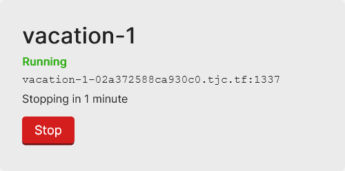

# How To Use Klodd

This is a guide for how to start, access, and stop challenges deployed using Klodd.

## Starting an Instance

When you first open the page for a challenge, you will see something like this:


To start an instance, simply click the "Start" button. The instance may remain in the "Starting" state for some time, after which it will transition to the "Running" state. At this point, the challenge instance is ready to be used.

## Accessing an Instance

A server address will be provided when an instance is in either the "Starting" or "Running" states.

### Web Challenges

If the challenge is accessible through a website, then no special action is needed. Either click the provided link or copy it into your solution script.


### TCP Challenges

If the challenge is accessible through a network socket, then you must connect, **using SSL**, to the host and port provided.

!!! warning "No netcat!"
    You can **not** use a regular `nc` command to connect to TCP challenges deployed using Klodd.



You have a few options here. If you are using [pwntools](https://github.com/Gallopsled/pwntools), then simply add `ssl=True` to your `remote` call. Otherwise, you may also use [socat](http://www.dest-unreach.org/socat/), version 1.7.4.0 or later.

??? example "Connecting with pwntools"
    ```python
    from pwn import remote

    r = remote('vacation-1-02a372588ca930c0.tjc.tf', 1337, ssl=True)
    ```

??? example "Connecting with socat"
    ```bash
    socat stdio openssl:vacation-1-02a372588ca930c0.tjc.tf:1337
    ```

??? example "Connecting with a socat proxy"
    ```bash
    socat tcp-listen:12345,fork,reuseaddr openssl:vacation-1-02a372588ca930c0.tjc.tf:1337

    # now you can use `nc localhost 12345` or `remote('localhost', 12345)`
    # as if it were a normal socket server
    ```

## Stopping an Instance

Each instance has a configured time limit, after which it will be stopped automatically. If you are finished with your instance before this happens, then you can click the "Stop" button to stop your instance early.
