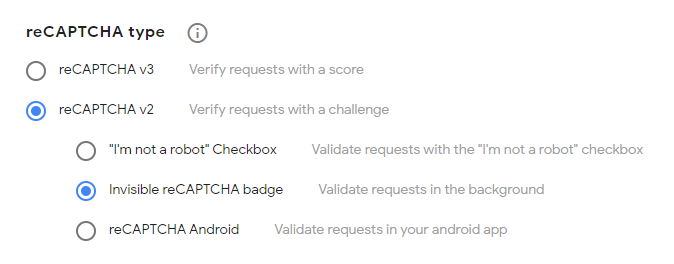

# Configuration

Klodd is configured using YAML[^1] files. Klodd will load all files with `.yaml` or `.yml` extensions in the configuration directory in order by filename, then merge all of them together. By default, the configuration directory is `/app/config/`, but this may be changed using the environment variable `KLODD_CONFIG`. All configuration options are required, though some have sensible defaults.

[^1]: Since YAML is a superset of JSON, including JSON or using entirely JSON in your `.yaml`/`.yml` files is valid and allowed.

## Reference

| Property          | Default        | Type                     | Description                                                                                    |
| ----------------- | -------------- | ------------------------ | ---------------------------------------------------------------------------------------------- |
| `challengeDomain` | _none_         | string                   | Challenges will be accessible through subdomains of this domain.                               |
| `kubeConfig`      | `'cluster'`    | string                   | Where the kubeconfig will be loaded from. [(details)](#kubeconfig)                             |
| `listen`          | `0.0.0.0:5000` | [ListenOptions][lo]      | ListenOptions passed to `fastify.listen` [(details)][lo]                                       |
| `publicUrl`       | _none_         | string                   | The URL where Klodd is publicly accessible.                                                    |
| `rctfUrl`         | _none_         | string                   | The URL where rCTF is publicly accessible.                                                     |
| `recaptcha`       | _test keys_    | object                   | The reCAPTCHA v2 keys. [(details)](#recaptcha)                                                 |
| `secretKey`       | _none_         | string                   | The secret key used to sign user tokens.                                                       |
| `traefik`         | _none_         | object                   | The Traefik entrypoints to use for challenges [(details)](#traefik)                            |
| `ingress`         | _none_         | [NetworkPolicyPeer][npp] | A source that will be allowed to access the exposed pod. [(details)](#traefik)                 |
| `reapInterval`    | `30000`        | integer                  | The interval, in milliseconds, that the expired instance reaper will run. [(details)](#reaper) |

[npp]: https://kubernetes.io/docs/reference/generated/kubernetes-api/v1.24/#networkpolicypeer-v1-networking-k8s-io
[lo]: https://nodejs.org/api/net.html#serverlistenoptions-callback

### kubeconfig

The `kubeConfig` property tells Klodd where to load the kubeconfig from. By default, this is set to `'cluster'`, which uses the [ServiceAccount token](https://kubernetes.io/docs/reference/access-authn-authz/authentication/#service-account-tokens) mounted to the pod Klodd is running in. The other option is `'default'`, which loads from `~/.kube/config` or whatever the [`KUBECONFIG` environment variable](https://kubernetes.io/docs/tasks/access-application-cluster/configure-access-multiple-clusters/#set-the-kubeconfig-environment-variable) is set to.

### reCAPTCHA

Klodd uses reCAPTCHA v2 to verify that requests to create and delete instances are not automated. First, [register a new site](https://www.google.com/recaptcha/admin/create), making sure to select "reCAPTCHA v2" and "Invisible reCAPTCHA badge" as shown below. Then, configure `recaptcha.siteKey` and `recaptcha.secretKey` with the keys you are given.

### Traefik

As mentioned in [Prerequisites](./prerequisites.md), you should have configured two Traefik entrypoints—one for web challenges and another for TCP challenges. Set `traefik.httpEntrypoint` and `traefik.tcpEntrypoint` to the names of these entrypoints, and set `traefik.tcpPort` to the port number of the exposed TCP entrypoint so it can be properly displayed on the frontend.

Additionally, ingress must be allowed from Traefik to the exposed pod of each instance. Set `ingress` to a [NetworkPolicyPeer][npp] object that matches Traefik. This will be used in a NetworkPolicy for each instance.

### Reaper

Klodd schedules termination of each instance when it is created, and restores these on startup. Normally, this is sufficient; however, Klodd also periodically runs a "reaper," which goes through all running instances and updates their scheduled termination. This ensures that no instances will remain running indefinitely. By default, the reaper runs every 30 seconds, but this interval can be configured with the `reapInterval` property.
